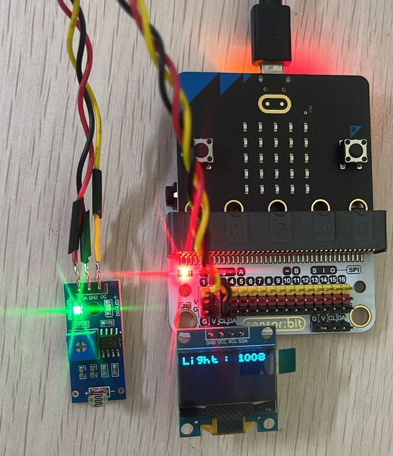

# LDR Light Sensor

An **LDR (Light Dependent Resistor)**, also called a photoresistor, changes its resistance based on the amount of light falling on it. This allows your micro:bit projects to **measure brightness** and respond to changes in ambient light.

---

## What It Does
The LDR outputs a varying voltage depending on light intensity. Your program can read this as an **analog value** (ranging from dark = low value to bright = high value) and use it to trigger actions such as turning on lights or adjusting displays.

---

## Real-World Applications
Light sensors are used in countless real-world systems, such as:

- 💡 **Automatic Street Lights** – Turning on at night and off in the morning.  
- 📱 **Smartphones** – Adjusting screen brightness based on ambient light.  
- 🏠 **Smart Homes** – Controlling curtains, lamps, or garden lighting automatically.  
- 🤖 **Robotics** – Light-following robots or obstacle detection.  
- 🔒 **Security Systems** – Detecting changes in light for alarms or monitoring.  

Using an LDR, students learn how to make their prototypes **react intelligently to environmental light conditions**.

✅ With the LDR, you can build projects that **respond to light**—from night lamps and alarms to smart energy-saving devices.

---
## Connection to the breakout

- Group of I2C female header, which can connect with OLED module.

{ width="420" height="240" }

- Connect the OLED module directly.

{ width="420" height="240" }

- Connect the LDR to the port P2.

{ width="420" height="240" }

-  Connection of LDR and OLED.

{ width="420" height="240" }

---

## Code

  <iframe
    style="position:absolute; top:0; left:0; width:100%; height:100%; border:1px solid #e0e0e0; border-radius:6px;"
    src="https://makecode.microbit.org/S72512-29156-09458-89919"
    allowfullscreen="allowfullscreen"
    frameborder="0"
    sandbox="allow-popups allow-forms allow-scripts allow-same-origin allow-downloads">
  </iframe>

---

