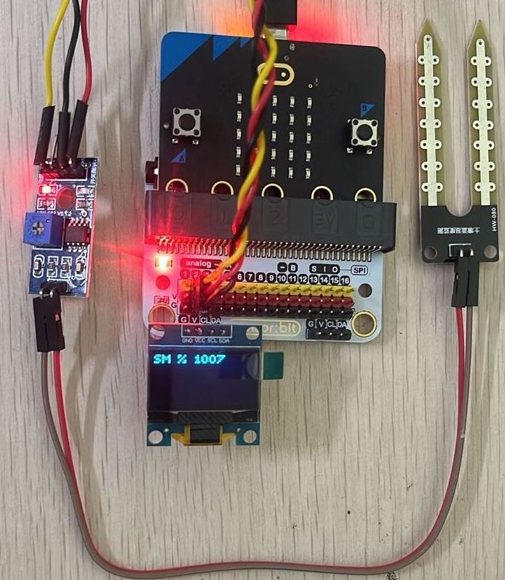

# Soil Moisture

A **Soil Moisture Sensor** is used to measure the **amount of water** present in the soil. It helps your micro:bit projects understand whether soil is dry or wet, enabling automatic watering and smart agriculture applications.

---

## What It Does

The moisture sensor outputs a varying signal depending on the water content in the soil.

- Dry soil → Lower moisture value
- Wet soil → Higher moisture value

The micro:bit reads this as an analog value, which can be used to trigger actions such as turning on a pump or displaying soil status

---

## Real-World Applications

Soil moisture sensing plays a key role in agriculture and smart systems:

- 🌱 Smart Irrigation Systems – Automatically watering plants when soil is dry
- 🚜 Agriculture Automation – Optimizing water usage in farms
- 🌿 Home Gardening – Maintaining healthy indoor and outdoor plants
- 🏡 Smart Greenhouses – Controlling watering cycles based on soil condition
- 🌍 Water Conservation Systems – Preventing overwatering and saving water

Using a moisture sensor, students learn how to build systems that respond to environmental conditions.

✅ With this sensor, you can create projects that care for plants automatically, making systems more efficient and intelligent.

---
## Connection to the breakout

- Group of I2C female header, which can connect with OLED module.

{ width="420" height="240" }

- Connect the OLED module directly.

{ width="420" height="240" }

- Connect the Soil Moisture metal probe to the module board using the black and red wires as shown below:

- Connect the Soil Moisture Sensor to the port P2.

{ width="420" height="240" }

-  Connection of Soil Moisture sensor and OLED.

{ width="420" height="240" }

---

## Code

  <iframe
    style="position:absolute; top:0; left:0; width:100%; height:100%; border:1px solid #e0e0e0; border-radius:6px;"
    src="https://makecode.microbit.org/_AfU2WgC23f1i"
    allowfullscreen="allowfullscreen"
    frameborder="0"
    sandbox="allow-popups allow-forms allow-scripts allow-same-origin allow-downloads">
  </iframe>

---

