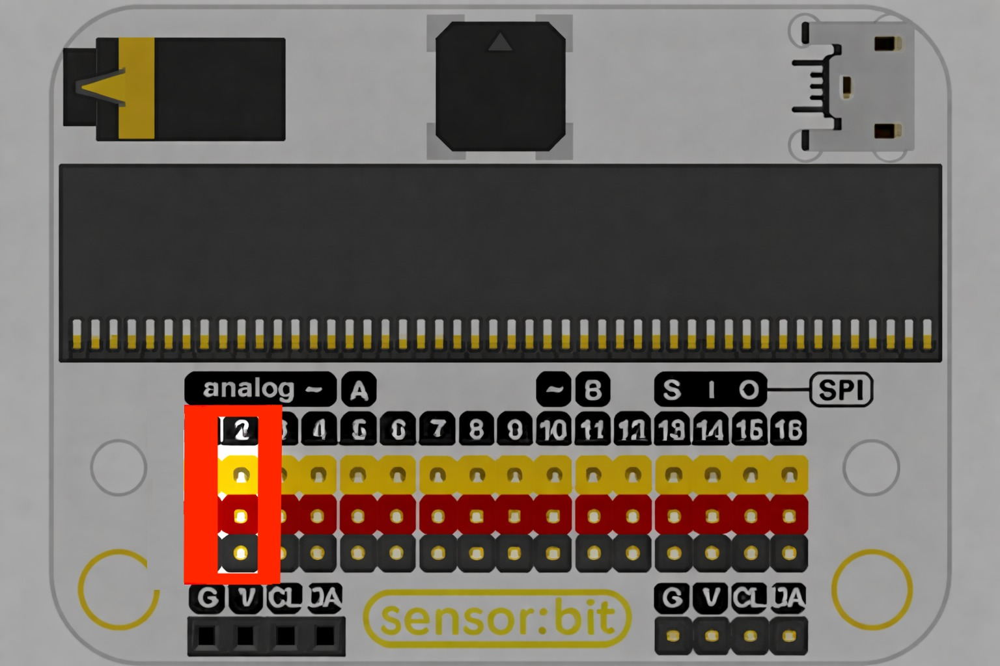
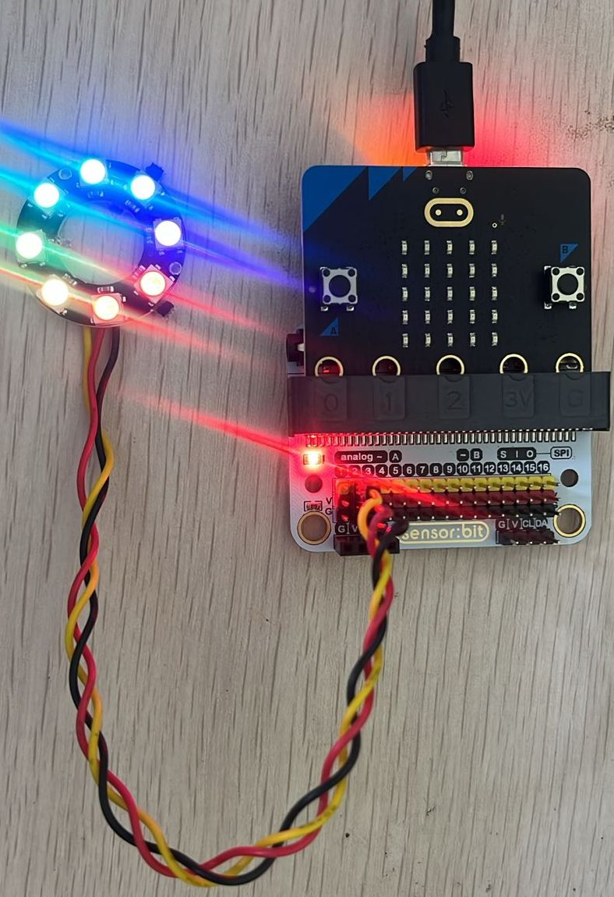

# NeoPixel Ring Patterns

The **NeoPixel Ring** is a circle of programmable RGB LEDs that can display millions of colors.  
By controlling each LED individually, you can create stunning **light patterns, animations, and visual feedback** for your projects.

---

## What It Does
This example animates the NeoPixel ring by cycling through different colors and patterns.  
You can easily modify the code to create effects such as rainbow fades, spinning lights, pulsing colors, or event-based indicators.

---

## Real-World Applications
NeoPixels are not just for decoration—they are powerful tools for:

- 🎨 **Creative Displays** – Interactive light shows, wearables, and art installations.  
- 📊 **Data Visualization** – Use colors and patterns to represent sensor readings (temperature, distance, etc.).  
- 🚦 **Status Indicators** – Show system states like ON/OFF, warnings, or levels (battery, signal, etc.).  
- 🕹️ **Gaming & Interaction** – Feedback lights for buttons, scoring systems, or timers.  
- 🤖 **Robotics** – Eye patterns, movement indicators, or robot “expressions.”  

With NeoPixels, you can make your prototypes **both functional and visually engaging**.

✅ Experiment with different color patterns and animations to turn your projects into **interactive, eye-catching experiences**.

---
## Connection to the breakout

- Connect the Neopixel ring to the port P2.
{ width="420" height="240" }

- Neopixel ring after connecting to port P2.
{ width="420" height="240" }

---

## Code

  <iframe
    style="position:absolute; top:0; left:0; width:100%; height:100%; border:1px solid #e0e0e0; border-radius:6px;"
    src="https://makecode.microbit.org/_AYf99fCjURVR"
    allowfullscreen="allowfullscreen"
    frameborder="0"
    sandbox="allow-popups allow-forms allow-scripts allow-same-origin allow-downloads">
  </iframe>

