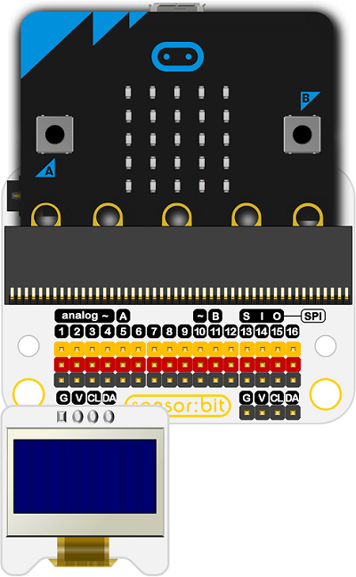

# OLED Display

The **OLED display** lets your projects show text, numbers, and simple graphics directly on the screen. This makes it easy to give **visual feedback**, display sensor readings, or create interactive menus for your prototypes.

---

## What It Does
This example writes the text **“STEM Smart Labs”** on the OLED display.  
It’s the simplest way to confirm your display is working and introduces the basics of outputting text on screen.

---

## Real-World Applications
OLED displays are used widely in devices where **clear, low-power visual output** is needed. With the OLED in this kit, students can explore:

- 📊 **Sensor Dashboards** – Show live temperature, humidity, or distance values.  
- 🔔 **Status Indicators** – Display ON/OFF states, error messages, or progress bars.  
- 🏠 **Smart Devices** – Provide user interfaces for IoT projects like timers or reminders.  
- 🤖 **Robotics** – Show robot modes, directions, or instructions.  
- 🎮 **Mini Games & Interfaces** – Create text-based games or menus for interactive projects.  

The OLED display transforms projects from **invisible logic** into **visible, interactive systems**.

✅ Once you can display “STEM Smart Labs” try showing **sensor values, scrolling messages, or even icons and graphics** to make your projects more engaging and interactive.

---
## Connection to the breakout

- Group of I2C female header, which can connect with OLED module.

{ width="420" height="240" }

- Connect the OLED module directly.

{ width="420" height="240" }

---

## Code

  <iframe
    style="position:absolute; top:0; left:0; width:100%; height:100%; border:1px solid #e0e0e0; border-radius:6px;"
    src="https://makecode.microbit.org/_TP7TrA0rsUHH"
    allowfullscreen="allowfullscreen"
    frameborder="0"
    sandbox="allow-popups allow-forms allow-scripts allow-same-origin allow-downloads">
  </iframe>

---

