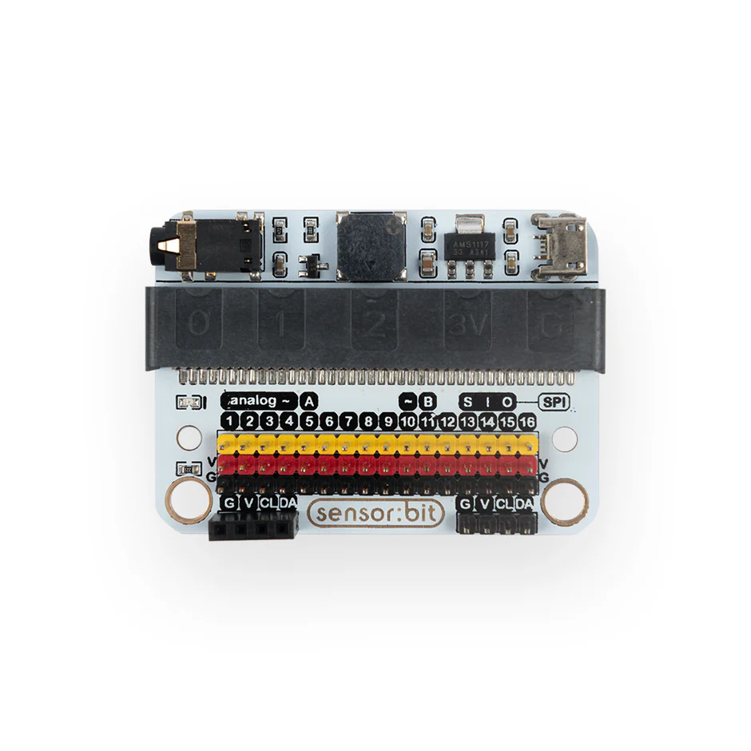
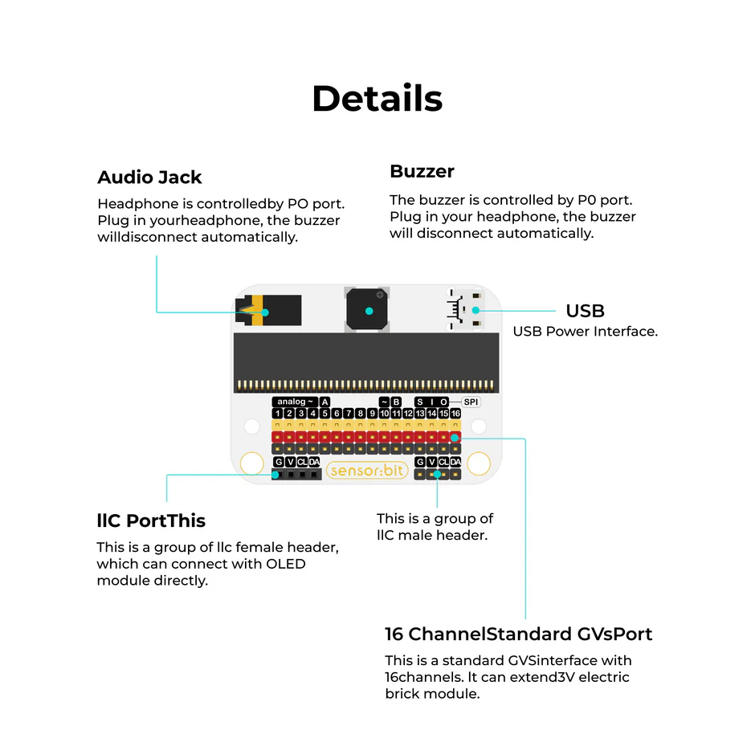
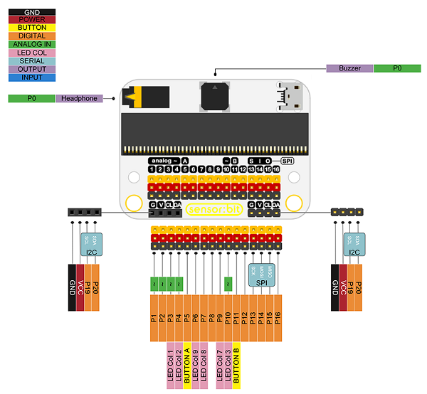
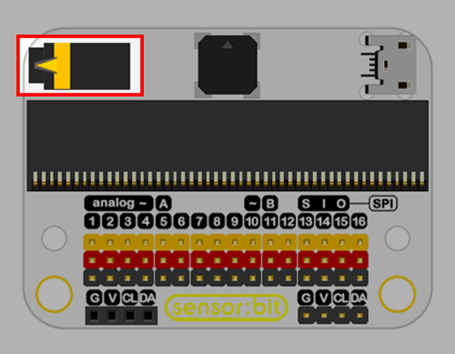
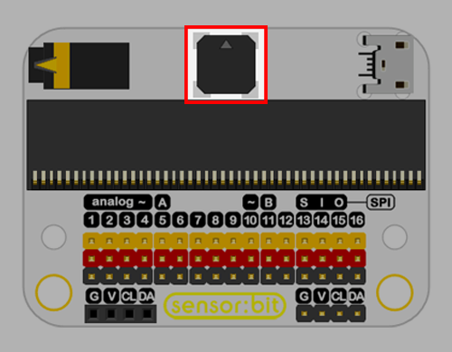
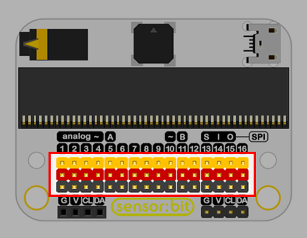
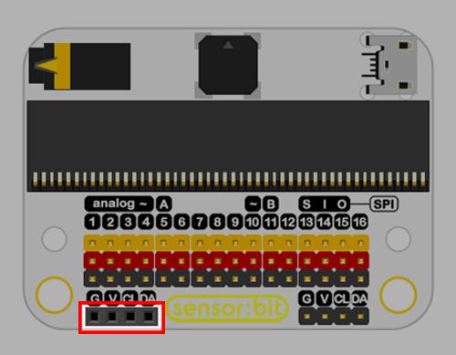
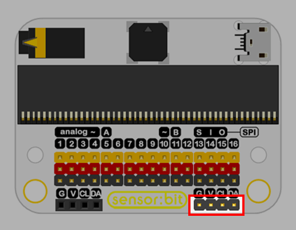
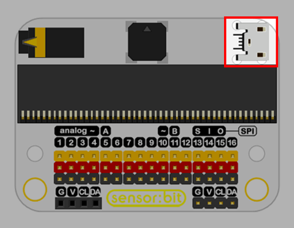
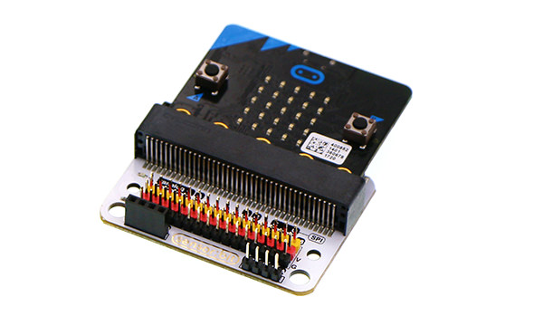

# Sensor:bit Expansion Board

The Sensor:bit Expansion Board is a powerful breakout board for the BBC micro:bit that makes it easy to connect sensors and actuators using plug-and-play connectors.

It eliminates the need for complex wiring by converting micro:bit pins into GVS style ports, making it ideal for beginners and classroom environments.

{ width="420" height="240" }

---

## What It Does

The Sensor:bit board expands the micro:bit by providing:

Multiple digital, analog, and I2C ports
Clearly labeled connectors for easy use
Stable power distribution for connected modules

This allows users to quickly build circuits by simply connecting sensors using cables—no breadboard required.

---

## Key Features
- Supports micro:bit
- Provides 3-pin connectors (VCC, GND, Signal)
- Includes I2C interface for displays like OLED
- Compact and classroom-friendly design
- Digital Ports to read/write digital signals
- Analog Ports to read analog values	LDR, Soil Moisture

The board acts as a bridge between the micro:bit and external components, simplifying hardware interaction.

---

## Example Usage

With the Sensor:bit board, you can easily build:

- 🌿 Smart Plant Watering System
- 🌡 Temperature & Humidity Monitor
- 🔆 Light Detection Projects
- 🎨 LED Animation Projects

All connections are done using cables, making setup quick and reliable.

---

## Audio Jack

- Headphone is controlled by P0 port. Plug in your headphone, the buzzer will disconnect automatically.

{ width="420" height="240" }

---

## Buzzer

- The buzzer is controlled by P0 port. Plug in your headphone, the buzzer will disconnect automatically.

{ width="420" height="240" }

---

## 16 Channel Standard GVS Port

- This is a standard GVS (Ground, Voltage and Signal) interface with 16 channels.

{ width="420" height="240" }

---

## I2C Port

- This is a group of I2C female header, which can connect with OLED module directly.

{ width="420" height="240" }

- This is a group of I2C male header.

{ width="420" height="240" }

---

## Powering the Board

The Sensor:bit board can be powered using:

- micro:bit USB connection
- Battery pack
- External power supply (for motors, pumps, etc.)

{ width="420" height="240" }

---

## Hardware Assembly

- The Sensor:bit Expansion Board transforms the micro:bit into a complete prototyping platform by simplifying connections and enabling rapid experimentation.

{ width="420" height="240" }

---

## Code

- Press button A on micro:bit, the buzzer starts to play music.

- Optional: Plug in your headphone to Audio Jack of sensor:bit, the buzzer stops playing music, and you can hear the music with your headphone.

  <iframe
    style="position:absolute; top:0; left:0; width:100%; height:100%; border:1px solid #e0e0e0; border-radius:6px;"
    src="https://makecode.microbit.org/_3At2iE5Ue3XK"
    allowfullscreen="allowfullscreen"
    frameborder="0"
    sandbox="allow-popups allow-forms allow-scripts allow-same-origin allow-downloads">
  </iframe>

