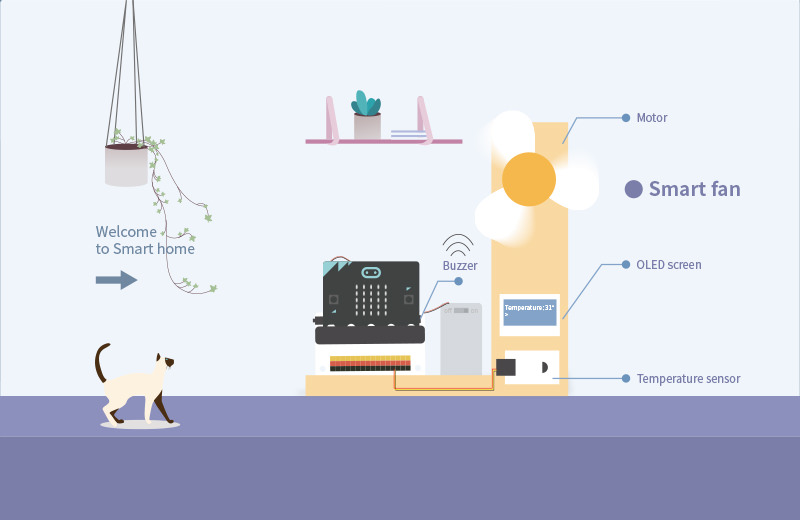
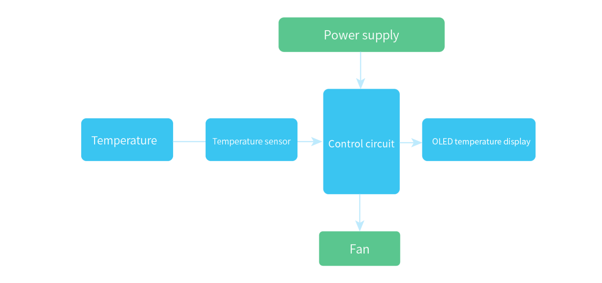
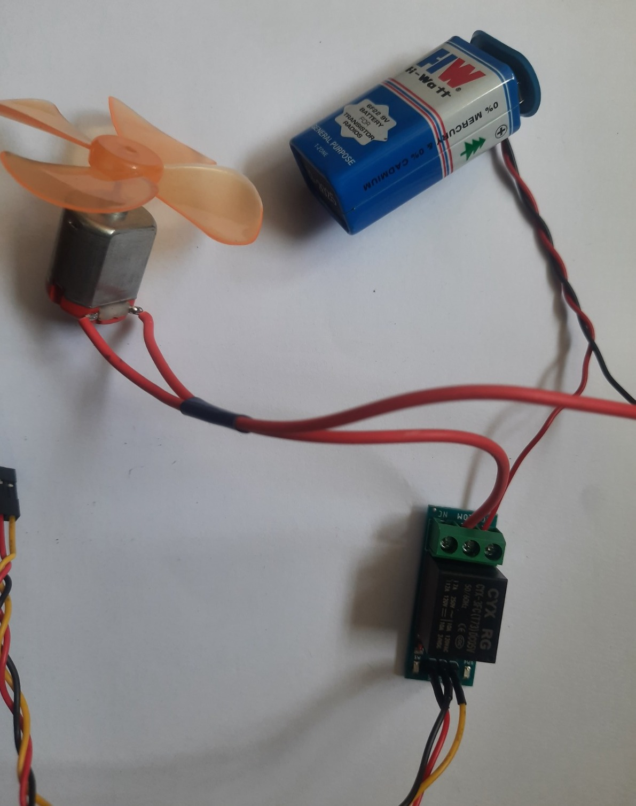
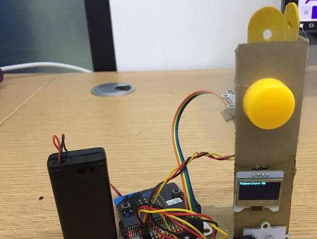
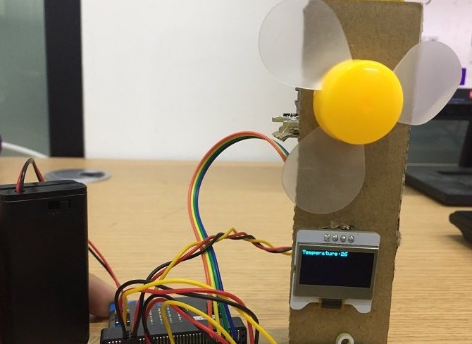

# Smart Fan Challenge

Design your **Smart Fan**, the fan should turn on automatically based on the ambient temperature at the room.
 
---

## What It has to do?

- The room is detected as hot when temperature degree is higher than threshold temperature which make people feel uncomfortable. Threshold temperature decide based on the ambient temperature in the room.

- The temperature sensor will send this signal to micro:bit，and micro:bit send the signal to the fan.

---

## Hardware to be Used

This project uses the following modules from the Neo Beginner Kit:

- **Temperature and Humidity Sensor** – Detects temperature and humidity level of the room

- **NeoPixel Ring** – If temperature is less than threshold temperature it is pleasant (green)

- **Relay Module** – Safely turns the fan ON and OFF

- **DC Motor with Fan** – DC Motor with Fan has to be connected to Relay module similar to water pump

- **OLED Display (I2C)** – Shows moisture level and pump status

- **Breakout Board + Connection Cables** – Plug-and-play connections to micro:bit 

---

## Desing you Smart Fan

- Model of the Smart fan

- Design of the Smart fan

---

## Working Model of Smart Fan

- Connection of the Relay to the fan

- When temperature degree is higher than threshold temperature fan turns ON to keep the room comfortable.

- When temperature degree is less than threshold temperature the fan will automatically stop.

✅ With a motor and fan, students can begin experimenting with **movement, airflow, and automation**—skills

---

