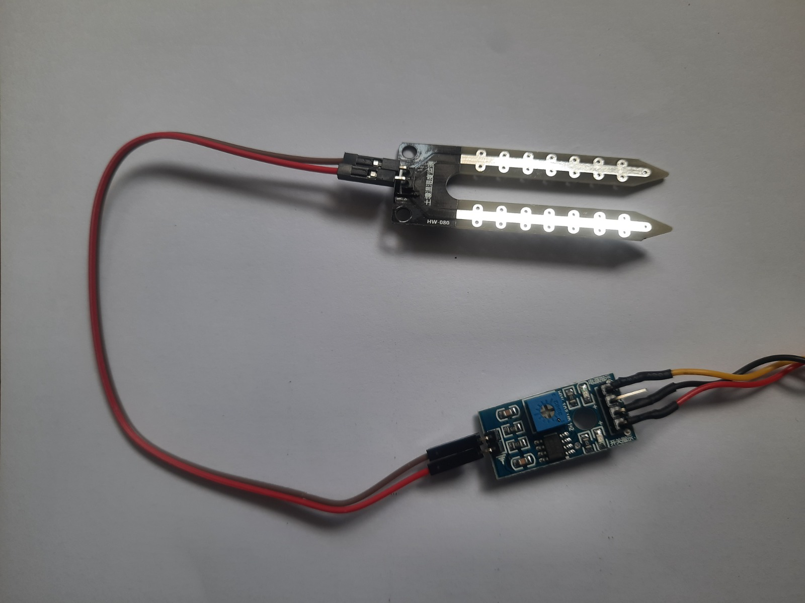
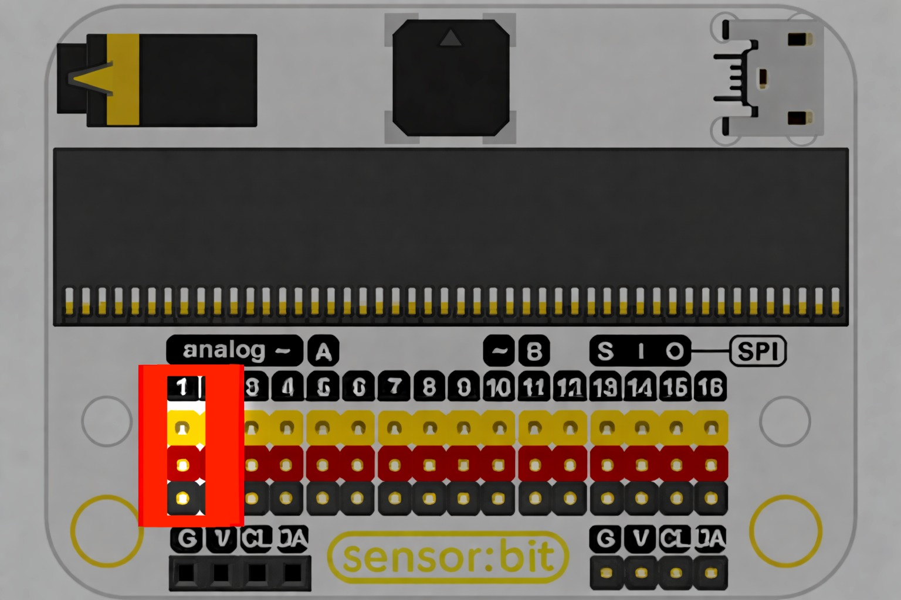
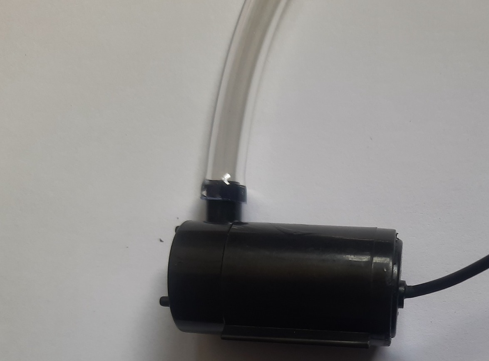
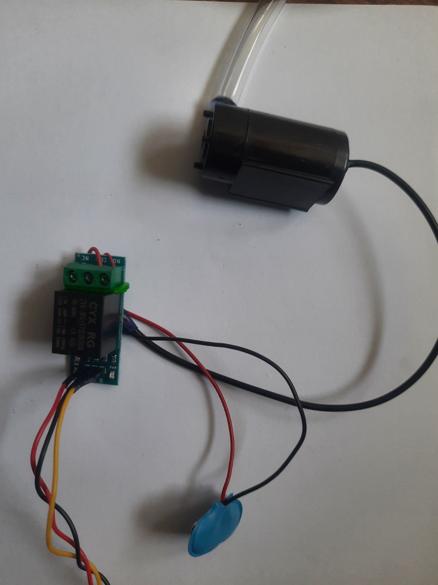
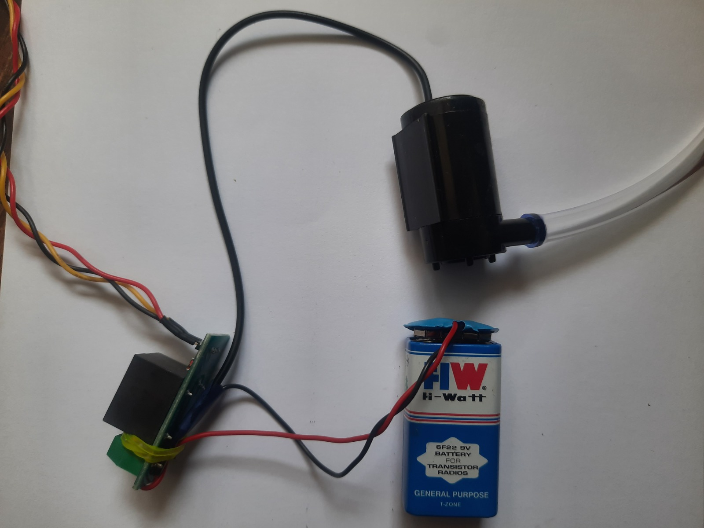

# Smart Plant Watering System

The **Smart Plant Watering System** is a beginner-friendly automation project that uses the micro:bit and the sensors in your Neo Beginner Kit to automatically water a plant based on soil moisture levels.
This project introduces students to environment sensing, conditional automation, and safe control of external devices using a relay and water pump.

---

## What It Does
The system continuously monitors the soil moisture sensor.

- If the soil is dry, the micro:bit activates the relay, turning ON the water pump to water the plant.

- If the soil is wet enough, the pump remains OFF.
The OLED display shows real-time soil readings and watering status, making it easier to understand how the system behaves.

This forms the foundation for environmental automation systems used in agriculture and home gardening.

---

## Hardware Used

This project uses the following modules from the Neo Beginner Kit:

- **Soil Moisture Sensor** – Detects dryness or moisture in the soil

- **NeoPixel Ring** – Shows whether the plant is happy (green) or sad (red)

- **Relay Module** – Safely turns the pump ON and OFF

- **Water Pump + Tube** – Pumps water into the plant

- **OLED Display (I2C)** – Shows moisture level and pump status

- **Breakout Board + Connection Cables** – Plug-and-play connections to micro:bit 

## How It Works

- The soil moisture sensor sends an analog value to the micro:bit.

- The micro:bit compares this value to a threshold (dry vs. wet).

- If the soil is dry, the micro:bit triggers the relay, powering the water pump.

- The pump runs for a few seconds and then stops to avoid overwatering.

✅ Once you understand how smart plant watering system works, you can expand this idea into different areas of agriculture.

---
## Connection to the breakout

- Connect the Soil Moisture metal probe to the module board using the black and red wires as shown below:

- Connect the Soil Moisture Sensor to the port P1.

{ width="420" height="240" }

- Connect the Neopixel ring to the port P2.

{ width="420" height="240" }

- Connect the tube to the pump.

{ width="420" height="240" }

- Connect 9V battery to the relay and the water pump.

{ width="420" height="240" }

- Connect the Relay to the port P8.

- Group of I2C female header, which can connect with OLED module.

{ width="420" height="240" }

- Connect the OLED module directly.

{ width="420" height="240" }

- **Always keep the microbit, breakout board and sensors away from the water before you turn on the circuit to avoid damage to it.** Only the pump and moisture sensor can be exposed to water.

---

## Code

  <iframe
    style="position:absolute; top:0; left:0; width:100%; height:100%; border:1px solid #e0e0e0; border-radius:6px;"
    src="https://makecode.microbit.org/_fcAHdTbtj1cc"
    allowfullscreen="allowfullscreen"
    frameborder="0"
    sandbox="allow-popups allow-forms allow-scripts allow-same-origin allow-downloads">
  </iframe>

---

