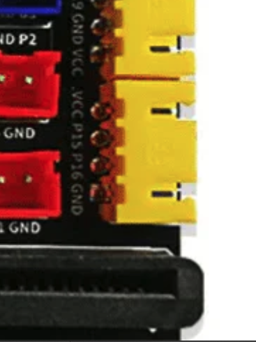
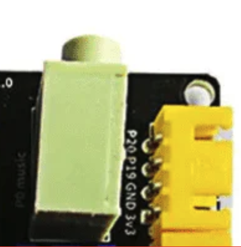

# Ultrasonic Sensor

The **Ultrasonic sensor** measures distance by sending out sound waves and timing how long they take to bounce back from an object. It’s a simple way to give your projects the ability to **“sense” the world around them**.

---

## What It Does
This example measures the distance to an object in front of the sensor and reports the value.  
By using sound instead of light, the ultrasonic sensor works reliably even in dark conditions.

---

## Real-World Applications
Ultrasonic sensors are widely used in systems where detecting distance or obstacles is important:

- 🚗 **Parking Assistance** – Reverse sensors in cars to avoid collisions.  
- 🤖 **Robotics** – Obstacle avoidance for autonomous robots.  
- 🏠 **Smart Home Projects** – Automatic water tank level monitoring or security systems.  
- 🏭 **Industrial Automation** – Detecting object positions on conveyor belts.  
- 🎮 **Interactive Projects** – Distance-based triggers for games or installations.  

With an ultrasonic sensor, students can build prototypes that **react to their environment** and move toward real-world automation.

✅ Once you can measure distance, you can extend this into projects like **robot navigation, smart alarms, or level detectors**.

---
## Connection to the breakout

- Connect the Ultrasonic to VCC, P15 , P16 and GND port (Yellow)

- Connect the OLED to P20, P19 , GND and 3v3 port (Yellow)

- Connection of Ultrasonic and OLED with the breakout board

{ width="420" height="240" }

---

## Code

  <iframe
    style="position:absolute; top:0; left:0; width:100%; height:100%; border:1px solid #e0e0e0; border-radius:6px;"
    src="https://makecode.microbit.org/S48418-52043-75256-00092"
    allowfullscreen="allowfullscreen"
    frameborder="0"
    sandbox="allow-popups allow-forms allow-scripts allow-same-origin allow-downloads">
  </iframe>

---

