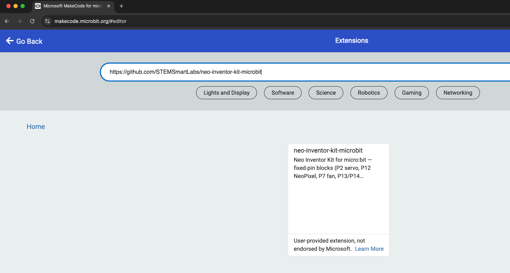

# Setup

The **Neo Inventor Kit for BBC Microbit** works seamlessly with the official [Microsoft MakeCode Editor](https://makecode.microbit.org/). MakeCode provides a friendly, browser-based environment where you can program the micro:bit using **Blocks**, **JavaScript**, or **Python**—making it suitable for both beginners and advanced learners.

---

## Install the Neo Inventor kit for Microbit Makecode extension

1. Open [https://makecode.microbit.org](https://makecode.microbit.org) in your browser.  

   
2. Click on **New Project** and create a project.  

   
3. In the MakeCode editor, click on the **⋯ (More)** menu, then select **Extensions**.  

   
4. In the search box, paste the GitHub URL:

   https://github.com/STEMSmartLabs/neo-inventor-kit-microbit
and press Enter, then click on the extension to install it.

Once installed, you will see the Neo Inventor Kit category in the MakeCode blocks panel.

---

## Prepare Your Hardware
1. Insert your **BBC micro:bit** into the slot on the Neo Inventor Kit board.  
2. Connect the micro:bit to your computer using a USB cable.  
3. The micro:bit will appear on your computer as a **USB drive**.

---

✅ With MakeCode, the **Neo Inventor Kit for BBC Microbit** becomes a fast, flexible, and student-friendly platform for **electronics, coding, and real-world problem solving**.  
